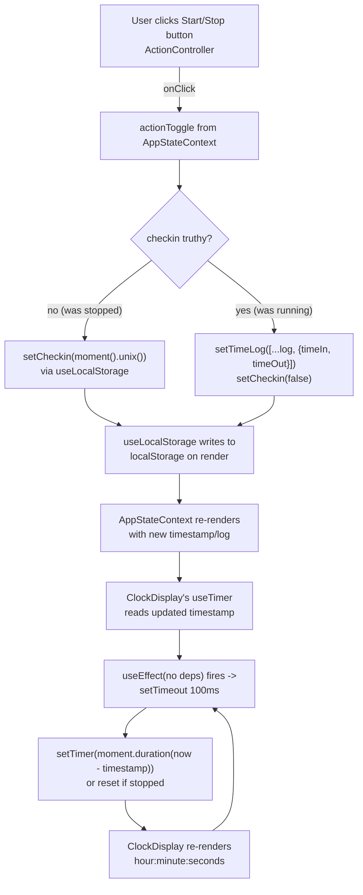

# Architecture (pre-modernization snapshot)

This document describes the app as it exists today, before any tooling,
styling, or UX modernization work begins. It is a snapshot, not a spec.

## Stack at time of writing

- Create React App (`react-scripts` 4.0.1), React 17, TypeScript 4
- `react-bootstrap` + `bootstrap` 5 for all UI components/styling
- `moment` for all date/duration math
- Package manager: Yarn (`yarn.lock` present)
- Tests: `react-scripts test` (Jest under the hood) + `@testing-library/react`
- No CI: there is no `.github/workflows` directory in this repo

## Component tree

```
index.tsx
└─ AppStageProvider        (src/contexts/AppStageContext.tsx)
   └─ AppStateProvider      (src/contexts/AppStateContext.tsx)
      └─ App                (src/components/App.tsx)
         ├─ ClockDisplay    (src/components/ClockDisplay.tsx)
         ├─ ActionController (src/components/ActionController.tsx)
         └─ Drawer          (src/components/Drawer.tsx)
```

`LogDisplay` (src/components/LogDisplay.tsx) exists but is **not mounted
anywhere** — see "Dead / unused code" below.

## Context: `AppStateContext`

File: `src/contexts/AppStateContext.tsx`

This is the one context that actually drives behavior. It exposes:

| Field          | Type              | Meaning                                                                 |
|----------------|-------------------|--------------------------------------------------------------------------|
| `timestamp`    | `false \| string` | Unix seconds (as a string) of the current check-in, or `false` if stopped |
| `log`          | `LogType[]`       | Array of `{ timeIn: string; timeOut: string }` (unix seconds, as strings) |
| `actionToggle` | `() => void`      | Start/stop toggle                                                       |
| `resetLog`     | `() => void`      | Clears `log` to `[]`                                                    |

Internally it uses `useLocalStorage` (src/hooks/useLocalStorage.ts) twice:
- `LOCALSTORAGE_CHECKIN_KEY` → the current `timestamp`/checkin value
- `LOCALSTORAGE_LOG_KEY` → the `log` array

`toggle()` logic:
- If not checked in (`!checkin`): stamps `moment().unix()` and stores it as
  the checkin timestamp (start of a session).
- If already checked in: pushes `{ timeIn: checkin, timeOut: newTimestamp }`
  onto `log`, then clears the checkin back to `false` (stop).

So persistence of the **checkin/log state** already exists today via
`useLocalStorage`, but the **live running timer's elapsed display** does not
persist/resume any differently — see the timer hook below.

## Context: `AppStageContext`

File: `src/contexts/AppStageContext.tsx`

Exposes a `currentStage` (`TimerStage` | `LogStage`) enum and an
`updateStage` setter. **This context is provided in `index.tsx` but no
component ever calls `useAppStage()`.** It's fully wired up (provider +
hook) but entirely unconsumed — dead state as of this snapshot.

## `useLocalStorage` hook

File: `src/hooks/useLocalStorage.ts`

Minimal `useState` wrapper: reads `localStorage.getItem(key)` once as the
lazy initial state, and calls `localStorage.setItem(key, JSON.stringify(value))`
**on every render** (not inside a `useEffect`, not gated on the value
changing). Returns `[value, setValue]` in the same shape as `useState`, but
without generics — the return type is implicitly `any[]`.

## `useTimer` hook — the core clock logic

File: `src/hooks/useTimer.ts`

```ts
export const useTimer = () => {
  const { timestamp } = useAppState();

  const reset = moment().set({ hour: 0, minute: 0, second: 0, millisecond: 0 });
  const [clock] = useState<Moment | Duration>(reset);
  const [timer, setTimer] = useState(clock);

  useEffect(() => {
    const timeout = setTimeout(() => {
      if (timestamp) {
        setTimer(moment.duration(moment().diff(moment.unix(parseInt(timestamp)))));
      } else {
        setTimer(reset);
      }
    }, 100);
    return () => clearTimeout(timeout);
  });

  return {
    hour: timer.hours(),
    minute: timer.minutes(),
    seconds: timer.seconds(),
    milliseconds: Math.floor(timer.milliseconds() * 0.1),
  };
};
```

How it works:
- **Elapsed calculation**: not a running "tick" — every 100ms it
  recomputes `moment.duration(now - checkinTimestamp)` from scratch. So the
  displayed duration is always derived from `Date.now()` minus the
  persisted `timestamp`, not from incrementing a counter.
- **The `useEffect` has no dependency array**, so it re-runs after *every*
  render (mount, and after every `setTimer` call), which is what drives the
  100ms polling loop — each run schedules the next `setTimeout`. This is a
  self-perpetuating effect pattern, not `setInterval`.
- `reset` and `clock` are computed once via `useState(reset)`'s lazy
  initializer semantics (`moment().set(...)` only evaluates once, on
  mount) and reused as the "zeroed" `Duration`/`Moment` when stopped.
- Return shape exposes `hour`/`minute`/`seconds` (all integers, no
  padding) and a `milliseconds` field that is actually **tenths of a
  second** (`Math.floor(ms * 0.1)`, range 0-9) — `milliseconds` is a
  misleading name for what's really a decisecond digit. Note this field is
  computed but **never consumed** by any component today.

### Edge cases actually handled

- **Page reload while stopped**: `timestamp` is `false` (from
  localStorage), `reset` duration is shown. Handled correctly.
- **Page reload while running**: `timestamp` is restored from
  localStorage by `AppStateContext`'s `useLocalStorage`, and `useTimer`
  recomputes `moment().diff(moment.unix(timestamp))` — so elapsed time
  correctly continues from the real start time rather than resetting to
  zero. This works *by construction* (diff against a persisted absolute
  timestamp), not because of any explicit reload-handling code.

### Edge cases NOT handled

- **Tab backgrounding / throttled timers**: no visibility-change
  listener, no `document.hidden` check, no correction for browser
  throttling of `setTimeout` in background tabs. Because the elapsed
  value is recomputed from an absolute timestamp diff (not accumulated
  tick-by-tick), throttling only delays *when* the display updates, not
  its *correctness* once it does update — but there's no explicit
  handling, it's incidental to the diff-based design.
- **Effect re-run cost**: because the `useEffect` dependency array is
  omitted, it tears down and re-schedules a `setTimeout` on every single
  render (including renders caused by unrelated state elsewhere in the
  tree, e.g. `Drawer`'s `show` state, since `useTimer` is called from
  `ClockDisplay` which is a sibling under the same `App` re-render scope
  only if such state is lifted — in practice here each component owns its
  own state so this is bounded to `ClockDisplay`, but still re-runs on
  every one of its own re-renders).
- **Negative/clock-skew durations**: if `timestamp` were ever in the
  future (clock skew, manual localStorage edits), `moment().diff(...)`
  would go negative and `moment.duration()` behavior on negative input is
  not accounted for.
- **No cleanup of the interval pattern across unmount racing with
  timeout firing**: mitigated by the `clearTimeout` in the effect
  cleanup, so this one *is* handled correctly.

## How components consume the context

- **`ClockDisplay`** (`src/components/ClockDisplay.tsx`): calls
  `useTimer()`, renders `hour:minute:seconds` (zero-padded to 2 digits)
  inside a `react-bootstrap` `Card`. Does not use `milliseconds`.
- **`ActionController`** (`src/components/ActionController.tsx`): calls
  `useAppState()` directly (not `useTimer`), reads `timestamp` to decide
  button label/color (`Start`/`success` vs `Stop`/`danger`) and wires
  `onClick` to `actionToggle`. Destructures `resetLog` but never calls it
  — unused.
- **`LogDisplay`** (`src/components/LogDisplay.tsx`): calls
  `useAppState()` for `log`, maps entries through `formatLog`. **Not
  rendered anywhere** in the current tree (see dead code below).
- **`Drawer`** (`src/components/Drawer.tsx`): purely local `useState` for
  offcanvas open/close; its "Log" and "Settings" buttons have no
  `onClick` handlers — they render but do nothing.
- **`App`** (`src/components/App.tsx`): composes `ClockDisplay` +
  `ActionController` + `Drawer`; does not consume either context
  directly itself.

## Data flow: user clicks Start/Stop → UI re-renders



The loop at the bottom (`I -> J -> K -> I`) is the self-scheduling 100ms
poll described above; it runs continuously while `ClockDisplay` is
mounted, independent of whether the timer is actually running (when
stopped, it just keeps re-setting `reset` every 100ms).

## Dead / unused code found during this audit

- `src/components/LogDisplay.tsx` — never imported/rendered.
- `src/contexts/AppStageContext.tsx` — provider wraps the app in
  `index.tsx`, but `useAppStage()` is never called anywhere.
- `src/lib/storage-reducer/storage-reducer.ts` — a reducer with
  `START_RECORDING`/`ADD_TASK`/`UPDATE_TASK`/`CLEAR_COMPLETED` action
  types, only referenced by its own spec file; not wired into any context
  or component.
- `Drawer`'s "Log" and "Settings" buttons — rendered, no handlers.
- `ActionController` destructures `resetLog` from context but never
  invokes it — there is currently no UI path to actually clear the log.
- `useTimer`'s `milliseconds` return value — computed, never read by any
  consumer.